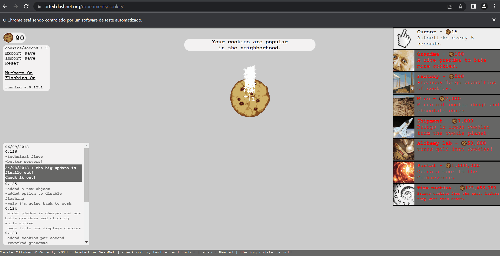

# Cookie Clicker Bot

Auto click bot for [Cookie Clicker](https://orteil.dashnet.org/experiments/cookie/) online game.




## Requirements

- Python version 3.10.6 or higher installed.
- Download ChromeDriver: https://chromedriver.chromium.org/downloads

## How to install

1. Download the project

2. Open the project folder in Command Prompt or Terminal.

3. Create a virtual environment and install the dependencies by running the following commands:
    -  Using `Poetry` (if you already have it installed):
        ```shell
            poetry install      # create a virtual environment and install dependencies
            poetry shell        # enable the environment
        ```

    - Using built-in `venv` module:

        - Linux or Mac
  
        ```bash
            python -m venv venv                 # create a virtual environment
            source venv/bin/activate            # enable the environment            
            pip install -r requirements.txt     # install the dependencies
        ```
        -  Windows (CMD)
  
        ```cmd
            python -m venv venv                 # create a virtual environment
            venv\Scripts\activate.bat           # enable the environment            
            pip install -r requirements.txt     # install the dependencies
        ```
        - Windows (Power Shell)
  
        ```ps
            python -m venv venv                 # create a virtual environment
            venv\Scripts\activate.ps1           # enable the environment            
            pip install -r requirements.txt     # install the dependencies
        ```

## How to run

```shell
    python cookie_clicker_bot
```